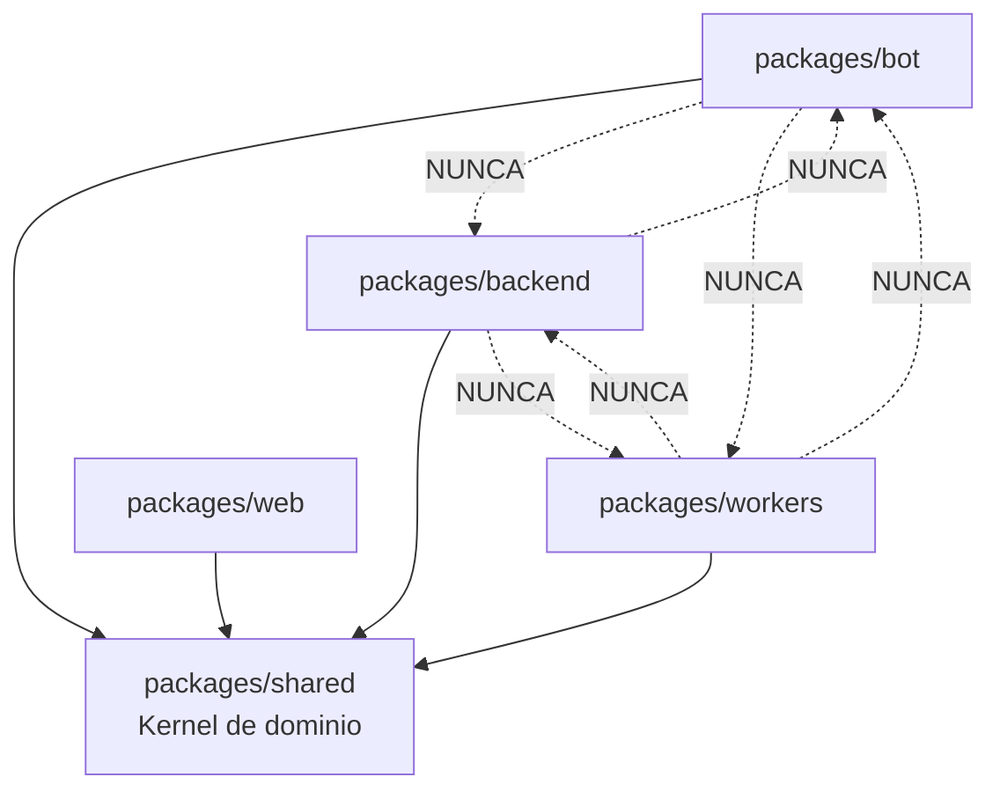
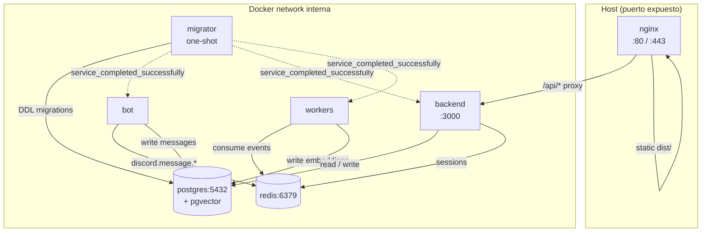
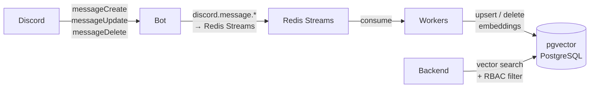
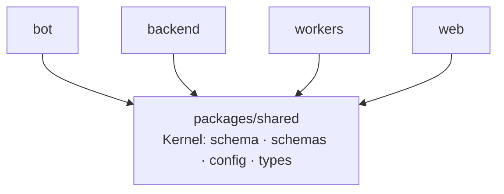

# Architecture Spine — Hivly Self-Hosted

## Design Paradigm

**Hexagonal (Shared Kernel) + Event-Driven Ingest (Redis Streams)**

`packages/shared` es el kernel de dominio: contiene el schema de base de datos (Drizzle), los contratos de API (Zod schemas), el cargador de configuración y los tipos compartidos. Los servicios (`bot`, `backend`, `workers`, `web`) son adaptadores que dependen de `shared` pero **nunca entre sí**.

La ingestión de conocimiento es **event-driven**: el Bot publica eventos de mensajes de Discord a Redis Streams con semántica at-least-once; los Workers los consumen vía consumer groups con ACK explícito. Un futuro stream `knowledge:events` (Epic 6) podría añadir a los Workers como productores. El Backend solo lee resultados del pipeline (PostgreSQL + pgvector); nunca escribe en los streams ni en las tablas de ingestión.



## Invariants & Rules

### AD-1 — Tres procesos de runtime independientes (actualmente)

- **Binds:** packages/bot, packages/backend, packages/workers
- **Prevents:** que un backfill de Discord sature la API REST; que un crash del Bot detenga el Agent Runtime; acoplamiento de ciclos de vida entre ingestión y servicio
- **Rule:** Bot, Backend y Workers son tres procesos Node.js separados, cada uno con su propio `package.json`, `Dockerfile` y entrada en `docker-compose.yml`. Ningún proceso importa código de otro paquete de servicio — solo de `packages/shared`. Un futuro proceso notifier está planeado pero no construido aún.

### AD-2 — Monorepo npm workspaces con kernel compartido

- **Binds:** toda la codebase
- **Prevents:** duplicación de schemas de DB, tipos de API o lógica de dominio entre servicios; divergencia de tipos entre Bot y Workers al acceder a la misma tabla
- **Rule:** La estructura del monorepo es `packages/{bot,backend,workers,web,shared}`. `packages/shared` contiene el schema Drizzle, los Zod schemas de API, el `loadConfig()` y los tipos de dominio. Los servicios importan de `@hivly/shared`; nunca de `@hivly/bot`, `@hivly/backend`, `@hivly/workers` entre sí.

### AD-3 — Web App como SPA estática (Vite + React)

- **Binds:** packages/web, nginx
- **Prevents:** añadir un cuarto proceso de aplicación a Compose; complejidad SSR innecesaria en una app con login obligatorio
- **Rule:** `packages/web` compila a estáticos en `dist/`. En producción, nginx sirve `dist/` directamente. El Backend no sirve ficheros del frontend. No existe un servidor Node para la Web App.

### AD-4 — Streaming del chat via SSE

- **Binds:** packages/backend (endpoint `POST /api/chat`), packages/web (cliente de chat)
- **Prevents:** complejidad de autenticación WebSocket; configuración extra de nginx; divergencia en el wire format del stream entre cliente y servidor
- **Rule:** El endpoint `POST /api/chat` devuelve `Content-Type: text/event-stream`. El cliente usa `fetch` con streaming (no `EventSource`, para poder hacer POST con body). No hay upgrade de protocolo WebSocket. El wire format de cada frame SSE es JSON con los tipos: `{"type":"token","content":"…"}` · `{"type":"citation","channel":"…","author":"…","date":"…"}` · `{"type":"done","conversationId":"…"}` · `{"type":"error","code":"…","message":"…"}`. Este schema está definido en `packages/shared/src/schemas/sse.ts`.

### AD-5 — Drizzle ORM como capa de acceso a DB

- **Binds:** packages/shared, packages/bot, packages/backend, packages/workers
- **Prevents:** definiciones de tabla duplicadas o divergentes entre servicios; migraciones en lenguajes o herramientas distintas
- **Rule:** El schema de todas las tablas se define en `packages/shared/src/db/schema.ts` con Drizzle. Las migraciones se generan con `drizzle-kit` como SQL explícito. Ningún servicio define tablas ni hace DDL fuera de `packages/shared`. Las queries a pgvector usan la extensión de vector de drizzle-orm.

### AD-6 — Contrato API mediante Zod schemas en shared

- **Binds:** packages/backend (validación runtime), packages/web (tipos TypeScript)
- **Prevents:** divergencia silenciosa entre shapes de request/response del frontend y backend
- **Rule:** Todo shape de request o response de la API REST está definido como Zod schema en `packages/shared/src/schemas/`. El backend valida con `schema.parse()`; el frontend infiere tipos con `z.infer<typeof schema>`. Ningún servicio define shapes de API localmente.

### AD-7 — nginx como punto de entrada HTTP único

- **Binds:** nginx, packages/web, packages/backend
- **Prevents:** que el Backend sirva estáticos de la SPA; competencia de recursos entre SPA y API; que el buffering de nginx rompa el streaming SSE en producción
- **Rule:** nginx sirve `packages/web/dist/` para rutas sin prefijo `/api` y hace reverse proxy de `/api/*` al Backend. Es el único servicio con puerto expuesto al host (80/443). El Backend escucha solo en red interna Docker. nginx es el punto de terminación TLS. Para la ruta `location /api/chat`, la config nginx DEBE incluir `proxy_buffering off; proxy_cache off; proxy_read_timeout 300s;` — sin esto el buffering de nginx bloquea el stream SSE hasta que la respuesta completa.

### AD-8 — Configuración centralizada via loadConfig() en shared

- **Binds:** packages/bot, packages/backend, packages/workers
- **Prevents:** interpretaciones divergentes del mismo campo de `Hivly.config.yml` entre servicios; validación inconsistente del YAML
- **Rule:** La función `loadConfig()` de `packages/shared/src/config/` parsea y valida `Hivly.config.yml` con un Zod schema. Todos los servicios llaman a `loadConfig()` en su `main.ts`; si el YAML es inválido, el proceso termina con error claro antes de inicializar nada más. Ningún servicio parsea el YAML localmente.

### AD-9 — Migraciones automáticas via servicio migrator en Compose

- **Binds:** docker-compose.yml, packages/shared (migraciones Drizzle), packages/bot, packages/backend, packages/workers
- **Prevents:** estado de DB inconsistente en upgrades; que un servicio arranque antes de que el schema esté listo
- **Rule:** El `docker-compose.yml` incluye un servicio `migrator` de vida corta que ejecuta `drizzle-kit migrate`. Los servicios `bot`, `backend` y `workers` DEBEN declarar `depends_on: { migrator: { condition: service_completed_successfully } }`. El servicio `migrator` no declara `restart: unless-stopped`. El operador nunca corre migraciones manualmente en producción.

### AD-10 — Sesiones de autenticación en Redis (connect-redis)

- **Binds:** packages/backend (middleware de autenticación), packages/shared (schema Drizzle)
- **Prevents:** un lookup a PostgreSQL por cada request autenticado; ambigüedad sobre si la tabla `sessions` del PRD existe o no
- **Rule:** `express-session` usa `connect-redis` como store. La cookie httpOnly contiene solo el session ID. Los datos de sesión (`{ userId, discordRoles }`) viven en Redis con TTL. La tabla `sessions` referenciada en el PRD DEBE NOT incluirse en el schema Drizzle — Redis es la única fuente de verdad de sesiones. Revocación inmediata: borrar la key Redis del session ID. `connect-redis` usa **`node-redis` (`redis`)** como cliente Redis — el cliente único del proyecto, el mismo que usan los workers para Streams. `connect-redis@9` soporta node-redis nativamente (dejó de soportar ioredis); node-redis es además el cliente recomendado para Redis 8.

### AD-11 — Agent Runtime con LangGraph StateGraph

- **Binds:** packages/backend (AgentRuntime)
- **Prevents:** uso de APIs LangChain legacy (ConversationSummaryBufferMemory, LLMChain) en proceso de deprecación; estado de conversación oculto en objetos de memoria
- **Rule:** El agente RAG se implementa como `StateGraph` de LangGraph con nodos explícitos: `retrieve → reason → respond`, con loop `tool_call` opcional. El historial de conversación es estado explícito del grafo (campo `messages` del state), comprimido cuando supera el presupuesto de tokens. Ningún componente del agente usa las APIs legacy de LangChain v0.2. Un ESLint `no-restricted-imports` rule en `packages/backend` prohíbe importar de `langchain/chains`, `langchain/memory` y módulos deprecated — esto es requisito del CI antes de mergear cualquier PR que toque `packages/backend/src/agent/`.

### AD-12 — RBAC aplicado a nivel de query vectorial

- **Binds:** packages/backend (endpoints `/api/search`, `POST /api/chat`, `/api/documents`, middleware de auth)
- **Prevents:** fuga de información de canales restringidos en resultados de búsqueda semántica o en el contexto RAG del agente; que el middleware y el query layer divergan en el cómputo de canales permitidos
- **Rule:** Toda query al índice pgvector incluye un filtro `WHERE channel_id = ANY(:allowed_channel_ids)`. La expansión `discordRoles → allowedChannelIds` ocurre en el middleware de auth de cada request, uniendo `session.discordRoles` contra la tabla `channel_permissions` (no se cachea en sesión, porque `channel_permissions` puede cambiar al reiniciar el Backend). La tabla `channel_permissions` se materializa desde `Hivly.config.yml` mediante upsert en el arranque del Backend, antes de aceptar requests. Ningún endpoint de búsqueda, chat o documentos ejecuta una query vectorial sin haber resuelto `allowedChannelIds` primero.

### AD-13 — Contrato de Redis Streams: keys, consumer groups y wire schema

- **Binds:** packages/bot (producer), packages/workers (consumers), packages/shared (tipos de eventos)
- **Prevents:** que el Bot publique en una key y los Workers lean de otra; consumer groups con nombres incompatibles que producen estado de stream irrecuperable
- **Rule:** Los stream keys, consumer groups y el schema mínimo de campos de cada evento son invariantes. El Bot publica a los keys de Discord; los Workers consumen de los groups de indexación. Un futuro stream `knowledge:events` (Epic 6) podría añadir a los Workers como productores y un notifier como consumidor:

| Stream key | Producer | Consumer group | Consumer |
|---|---|---|---|
| `hivly:discord:messages` | bot | `hivly:indexer` | workers/indexer |
| `hivly:discord:messages:updated` | bot | `hivly:sync` | workers/sync |
| `hivly:discord:messages:deleted` | bot | `hivly:sync` | workers/sync |
| `hivly:knowledge:events` *(planned — Epic 6)* | workers/bot | `hivly:notifier` | notifier *(deferred)* |

Campos mínimos obligatorios en cada mensaje de stream: `messageId` (snowflake string), `channelId` (string), `guildId` (string), `timestamp` (ISO 8601). Los tipos de evento están definidos en `packages/shared/src/types/events.ts`. Los Workers hacen ACK (`XACK`) solo tras procesar con éxito; no hacen ACK si el procesamiento falla (permite reintento automático por otro consumer del mismo group).

## Consistency Conventions

| Concern | Convention |
|---|---|
| Naming — paquetes | `@hivly/{bot,backend,workers,web,shared}` en cada `package.json` |
| Naming — ficheros TypeScript | `camelCase.ts` para módulos, `PascalCase.ts` para clases y componentes React |
| Naming — eventos Redis Streams | `discord.message.{created,updated,deleted}`, `discord.backfill.completed`, `discord.sync.completed`, `knowledge.events` |
| Naming — endpoints REST | `/api/<recurso>` en kebab-case plural; parámetros de ruta en camelCase (ej. `/api/conversations/:conversationId`) |
| IDs | Discord snowflake (string) para entidades Discord; UUID v4 para entidades propias (conversaciones, embeddings) |
| Fechas | ISO 8601 UTC en todos los shapes serializados; `timestamp with time zone` en PostgreSQL |
| Error shape API | `{ error: string, code: string }` — definido en `packages/shared/src/schemas/errors.ts` |
| Propiedad de escritura | Solo el servicio que "posee" una tabla escribe en ella (ver State Ownership en Structural Seed) |
| Logging | Nivel configurado via `observability.log_level` en `Hivly.config.yml`; todos los servicios usan el logger exportado desde `packages/shared` |
| Auth | Toda request a `/api/*` excepto `/api/auth/*` y `/health` requiere sesión válida en Redis |
| Secretos vs configuración | Secretos solo en `.env`; configuración de comportamiento solo en `Hivly.config.yml` — nunca mezclar los dos ficheros |

## Stack

| Nombre | Versión |
|---|---|
| Node.js | 24 LTS |
| TypeScript | 6.0 |
| React | 19.2 |
| Vite | 8.1 |
| Express | 5.2 |
| @langchain/langgraph | 1.4 |
| @langchain/core | 1.2 |
| drizzle-orm | 0.45 |
| drizzle-kit | 0.31 |
| discord.js | 14.26 |
| zod | 4.4 |
| express-session | 1.x |
| connect-redis | 9.0 |
| node-redis (`redis`) | 6.x |
| PostgreSQL | 17 |
| pgvector | 0.8.2 |
| Redis | 8 |
| nginx | 1.27 (mainline) |
| Docker Compose | 2 |

## Structural Seed

### Topología Docker Compose (7 servicios)



### Pipeline de ingestión



### Reglas de dependencia entre paquetes



### Árbol de fuentes (seed)

```text
hivly/
  packages/
    shared/                   # Kernel de dominio (@hivly/shared)
      src/
        db/
          schema.ts           # Drizzle schema — fuente de verdad de tablas
          index.ts            # Cliente Drizzle exportado
          migrations/         # SQL generado por drizzle-kit
        schemas/              # Zod schemas de API + error shape
          errors.ts
        config/
          index.ts            # loadConfig() + Zod schema de Hivly.config.yml
        types/                # Tipos de dominio compartidos
    bot/                      # Discord Bot — ingestión (@hivly/bot)
      src/
        main.ts
        listeners/            # messageCreate, messageUpdate, messageDelete
        backfiller/
        publisher/            # EventPublisher → Redis Streams
      Dockerfile
    backend/                  # Express API + LangGraph Agent (@hivly/backend)
      src/
        main.ts
        routes/               # Endpoints REST + SSE /api/chat
        agent/                # StateGraph: retrieve → reason → respond
        middleware/           # Auth, rate-limit, RBAC channel filter
      Dockerfile
    workers/                  # Indexer + Sync consumers (@hivly/workers)
      src/
        main.ts
        indexer/              # Consume discord.message.created → embed → pgvector
        sync/                 # Consume updated/deleted → re-index/purge
      Dockerfile
    web/                      # Vite + React SPA (@hivly/web)
      src/
        main.tsx
        views/                # Search, Documents, Chat, ReadStatus
        components/
        api/                  # Fetch wrappers tipados con z.infer<>
      Dockerfile              # Multi-stage: build → nginx para dev; prod sirve via nginx global
  docker-compose.yml          # 7 servicios: migrator + nginx + bot + backend + workers + postgres + redis
  Hivly.config.yml
  .env
```

### State Ownership (propiedad de escritura)

| Tabla | Propietario (escribe) | Lectores |
|---|---|---|
| `discord_messages` | bot | workers, backend |
| `embeddings` | workers — Indexer (insert), Sync (update/delete) | backend |
| `channel_permissions` | backend (upsert al arrancar desde config) | backend |
| `user_roles_cache` | backend (login + refresh OAuth2) | backend |
| `conversations`, `messages` | backend | web (via API) |
| `user_read_status` | backend | web (via API) |
| `users` | backend (login Discord OAuth2) | backend |
| Sesiones | Redis — backend via connect-redis | backend |

## Capability → Architecture Map

| Capability / Área | Vive en | Gobernado por |
|---|---|---|
| SO-1 Indexación automática de mensajes | packages/bot + packages/workers | AD-1, AD-2, AD-5 |
| SO-2 Búsqueda semántica | packages/backend `GET /api/search` | AD-5, AD-6, AD-12 |
| SO-3 Chat con agente RAG (streaming) | packages/backend `POST /api/chat` SSE | AD-4, AD-11, AD-12 |
| SO-4 Read Tracking | packages/backend + packages/web | AD-6 |
| SO-5 Configuración como código | packages/shared `loadConfig()` | AD-8 |
| SO-6 Despliegue trivial (un comando) | docker-compose.yml | AD-1, AD-9 |
| SO-7 Datos bajo control (self-hosted) | postgres + docker network interna | AD-7 |
| SO-8 Un despliegue = un guild | packages/shared config (guild_id) | AD-8 |
| Discord OAuth2 Auth | packages/backend middleware | AD-10 |
| RBAC por canal Discord | packages/backend + channel_permissions | AD-12 |
| Sync ediciones/borrados | packages/bot (listeners) + packages/workers (sync/) | AD-1, AD-2 |
| Backfill histórico | packages/bot (backfiller/) | AD-1 |
| Notificaciones operador (Telegram/Slack) | packages/workers o packages/backend | Deferred |

## Deferred

- **Notificador (Telegram/Slack):** El PRD lo lista como componente separado pero no está decidido si vive en `packages/workers` (junto a los eventos de knowledge) o en `packages/backend`. Deferred a la historia de notificaciones.
- **Retry y dead-letter en Redis Streams (DLQ):** AD-13 fija los consumer groups y el ACK discipline. La política de máximo de reintentos, `MAXLEN` del stream y el destino del dead-letter (si lo hay) es deferred a la historia de Workers.
- **Framework CSS / UI components:** Tailwind + shadcn/ui vs CSS Modules — no afecta la consistencia entre servicios. Deferred al builder de packages/web.
- **Frontend server state (data fetching):** TanStack Query vs SWR — deferred al builder de packages/web; debe respetar AD-6 (tipos inferidos de Zod).
- **Test framework y estrategia:** Vitest para unit/integration, Playwright para e2e — asumido pero no fijado como invariante.
- **TLS / HTTPS en nginx:** Configuración de certificados (Let's Encrypt, cert manual) deferred a la guía de operaciones.
- **Health checks de Compose:** Scripts de probe para cada servicio deferred al builder de docker-compose.
- **Abstracción explícita del proveedor LLM:** LangChain.js maneja los adaptadores de proveedor (Anthropic, OpenAI), pero la interfaz de abstracción propia en shared (si se necesita) es deferred.
- **Estrategia de batching del Indexer:** El `grouping_window` y `chunk_overlap` están en config; la lógica exacta de batching es deferred a la historia del Indexer Worker.
- **Observabilidad detallada:** Sentry está referenciado en el PRD vía `SENTRY_DSN`; la estrategia de instrumentación (qué errores, qué traces) es deferred.
- **Topología de desarrollo local:** En dev, el builder de `packages/web` levanta el Vite dev server (puerto 5173) mientras el Backend corre en el puerto 3000 — los orígenes son distintos. La configuración CORS del Backend (variable `FRONTEND_URL`) y el proxy de Vite (`vite.config.ts`) para `/api/*` son deferred al setup de desarrollo; no afectan la topología de producción gobernada por AD-7.
- **nginx image tag explícito:** Para evitar actualizaciones silenciosas en producción, el `docker-compose.yml` DEBE pintar `nginx:1.27-alpine` (o la versión exacta que elija el builder) en lugar de `nginx:latest`. Deferred al builder de docker-compose.
