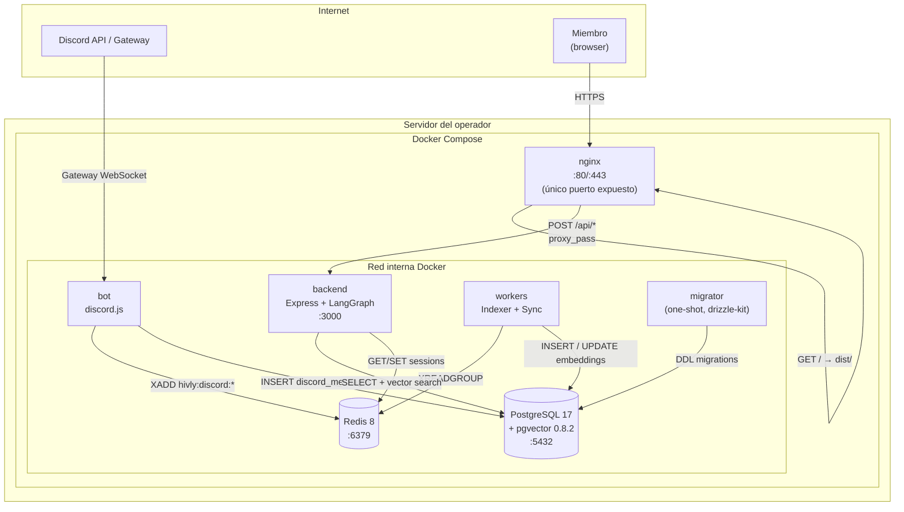
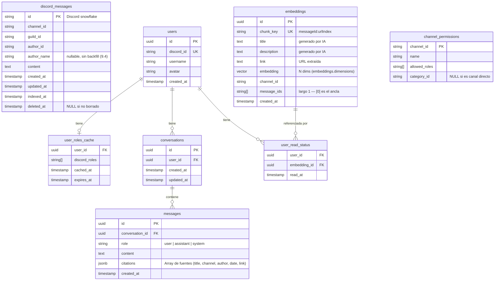
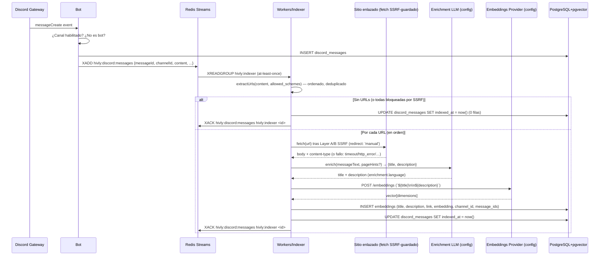
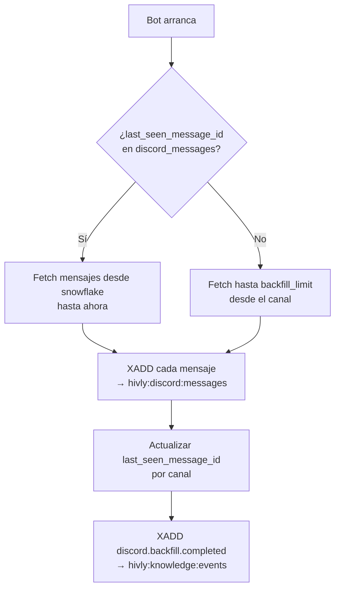
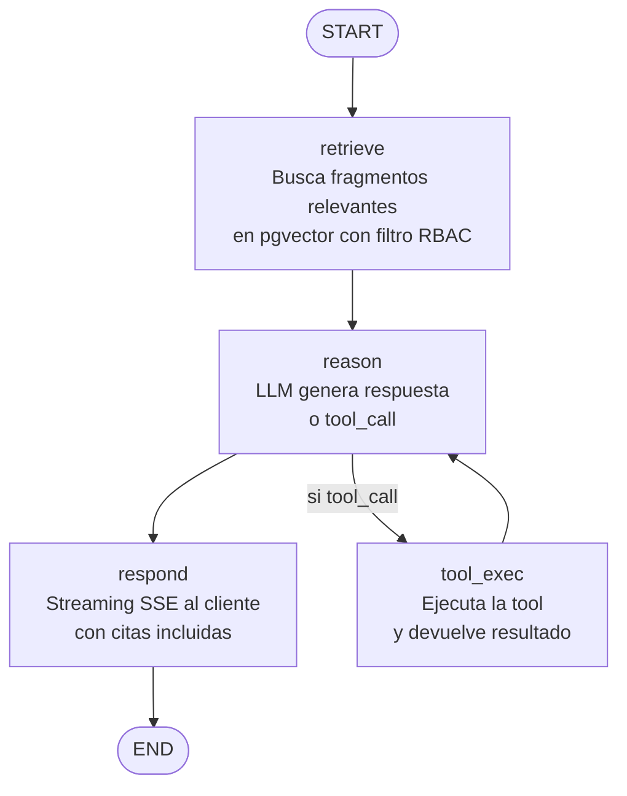
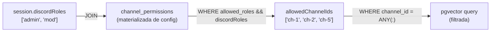

# Diseño Técnico — Hivly Self-Hosted

| | |
|---|---|
| **Proyecto** | Hivly Self-Hosted |
| **Versión** | 1.0 |
| **Fecha** | 30 de junio de 2026 |
| **Estado** | Final |
| **Fuente** | Derivado de `ARCHITECTURE-SPINE.md` + `docs/PRD.md` |

---

## Índice

1. [Resumen ejecutivo](#1-resumen-ejecutivo)
2. [Principios de diseño](#2-principios-de-diseño)
3. [Visión general del sistema](#3-visión-general-del-sistema)
4. [Estructura del monorepo](#4-estructura-del-monorepo)
5. [Servicios](#5-servicios)
   - 5.1 [packages/shared — Kernel de dominio](#51-packagesshared--kernel-de-dominio)
   - 5.2 [packages/bot — Discord Bot](#52-packagesbot--discord-bot)
   - 5.3 [packages/workers — Indexer + Sync](#53-packagesworkers--indexer--sync)
   - 5.4 [packages/backend — API + Agente RAG](#54-packagesbackend--api--agente-rag)
   - 5.5 [packages/web — Web App SPA](#55-packagesweb--web-app-spa)
   - 5.6 [nginx — Punto de entrada HTTP](#56-nginx--punto-de-entrada-http)
6. [Modelo de datos](#6-modelo-de-datos)
7. [Pipeline de ingestión](#7-pipeline-de-ingestión)
8. [Sistema de eventos: Redis Streams](#8-sistema-de-eventos-redis-streams)
9. [Agente RAG: LangGraph StateGraph](#9-agente-rag-langgraph-stategraph)
10. [Autenticación y RBAC](#10-autenticación-y-rbac)
11. [API REST](#11-api-rest)
12. [Streaming SSE del chat](#12-streaming-sse-del-chat)
13. [Configuración](#13-configuración)
14. [Despliegue](#14-despliegue)
15. [Stack tecnológico](#15-stack-tecnológico)
16. [Decisiones de arquitectura](#16-decisiones-de-arquitectura)
17. [Pendiente (Deferred)](#17-pendiente-deferred)

---

## 1. Resumen ejecutivo

Hivly es un agente de IA que indexa automáticamente el conocimiento de una comunidad de Discord y responde preguntas en lenguaje natural con fuentes verificables. Cada operador despliega una instancia independiente que sirve a un único servidor Discord (guild) con un solo comando: `docker compose up -d`.

Este documento describe la arquitectura técnica completa del sistema: cómo están organizados los servicios, cómo se comunican, qué datos almacenan y por qué se tomaron las decisiones clave. Es el documento de referencia para cualquier persona que construya, extienda o revise el sistema.

**Lo que construye este documento:**

```
Discord Bot  →  Redis Streams  →  Workers (Indexer + Sync)  →  PostgreSQL + pgvector
                                                                        ↑
                                                              Backend (Express + LangGraph)
                                                                        ↑
                                                                   nginx + React SPA
```

---

## 2. Principios de diseño

El sistema sigue dos patrones combinados:

### Hexagonal (Shared Kernel)

`packages/shared` es el kernel de dominio. Contiene el schema de base de datos, los contratos de API y la configuración. Los cuatro servicios de aplicación (`bot`, `backend`, `workers`, `web`) son adaptadores que dependen del kernel pero **nunca entre sí**.

La regla más importante del monorepo: **los servicios no se importan entre sí**. Si el bot necesita un tipo que también usa el backend, ese tipo vive en `packages/shared`, no en `packages/backend`.

```
packages/shared   ←── todos los servicios dependen de esto
packages/bot      ──┐
packages/backend  ──┼── nunca se importan entre sí
packages/workers  ──┘
packages/web      ───── solo importa de shared (tipos + schemas)
```

### Event-Driven Ingest (Redis Streams)

La ingestión de conocimiento es asíncrona y desacoplada. El Bot no indexa — publica eventos. Los Workers no escuchan Discord — consumen eventos. Este desacoplamiento tiene una consecuencia operacional importante: un backfill de 100.000 mensajes no degrada la API REST, y si el proceso de Workers cae, los eventos esperan en Redis hasta que vuelva (at-least-once delivery con consumer groups y ACK explícito).

---

## 3. Visión general del sistema

### Topología completa de producción



### Las siete entidades de Compose

| Servicio | Tipo | Descripción |
|---|---|---|
| `migrator` | one-shot | Corre `drizzle-kit migrate` y termina. El resto depende de él. |
| `nginx` | long-running | Sirve la SPA y hace proxy de la API. Puerto 80/443. |
| `bot` | long-running | Conecta al Discord Gateway, publica eventos. |
| `backend` | long-running | Express API + LangGraph Agent. |
| `workers` | long-running | Indexer + Sync consumers de Redis Streams. |
| `postgres` | long-running | PostgreSQL 17 + pgvector 0.8.2. |
| `redis` | long-running | Redis 8. Streams de eventos + sesiones. |

---

## 4. Estructura del monorepo

```
hivly/
├── packages/
│   ├── shared/               # @hivly/shared — kernel de dominio
│   │   └── src/
│   │       ├── db/
│   │       │   ├── schema.ts         # Drizzle: fuente de verdad de tablas
│   │       │   ├── index.ts          # Cliente Drizzle exportado
│   │       │   └── migrations/       # SQL generado por drizzle-kit
│   │       ├── schemas/              # Zod schemas de API
│   │       │   ├── errors.ts         # { error: string, code: string }
│   │       │   └── sse.ts            # Wire types del stream SSE
│   │       ├── config/
│   │       │   └── index.ts          # loadConfig() + Zod schema del YAML
│   │       └── types/
│   │           └── events.ts         # Tipos de eventos Redis Streams
│   │
│   ├── bot/                  # @hivly/bot — Discord Bot
│   │   ├── src/
│   │   │   ├── main.ts
│   │   │   ├── listeners/            # messageCreate, messageUpdate, messageDelete
│   │   │   ├── backfiller/           # Indexación histórica al arrancar
│   │   │   └── publisher/            # EventPublisher → Redis Streams
│   │   └── Dockerfile
│   │
│   ├── backend/              # @hivly/backend — Express API + Agente
│   │   ├── src/
│   │   │   ├── main.ts
│   │   │   ├── routes/               # REST endpoints + /api/chat SSE
│   │   │   ├── agent/                # LangGraph StateGraph
│   │   │   └── middleware/           # Auth, rate-limit, RBAC filter
│   │   └── Dockerfile
│   │
│   ├── workers/              # @hivly/workers — Indexer + Sync
│   │   ├── src/
│   │   │   ├── main.ts
│   │   │   ├── indexer/              # Consume created → embed → pgvector
│   │   │   └── sync/                 # Consume updated/deleted → re-index/purge
│   │   └── Dockerfile
│   │
│   └── web/                  # @hivly/web — Vite + React SPA
│       ├── src/
│       │   ├── main.tsx
│       │   ├── views/                # Search, Documents, Chat, ReadStatus
│       │   ├── components/
│       │   └── api/                  # Fetch wrappers tipados con z.infer<>
│       └── Dockerfile                # Multi-stage: build → dist/
│
├── docker-compose.yml
├── Hivly.config.yml          # Configuración de comportamiento
└── .env                      # Secretos (tokens, API keys)
```

### Regla fundamental de imports

```typescript
// ✅ Correcto — desde cualquier servicio
import { discordMessages } from '@hivly/shared/db/schema'
import { SearchResponseSchema } from '@hivly/shared/schemas'
import { loadConfig } from '@hivly/shared/config'

// ❌ Incorrecto — servicios no se importan entre sí
import { something } from '@hivly/backend'  // PROHIBIDO desde bot, workers, web
import { something } from '@hivly/bot'      // PROHIBIDO desde backend, workers, web
```

---

## 5. Servicios

### 5.1 packages/shared — Kernel de dominio

El paquete del que todos dependen y que no depende de nadie. Sus cuatro responsabilidades son estrictamente separadas:

**`src/db/schema.ts`** — Schema Drizzle. Definición de todas las tablas. Ningún servicio define tablas fuera de este fichero.

**`src/schemas/`** — Zod schemas de API. El backend los usa para validar inputs en runtime con `schema.parse()`; el frontend los usa solo para inferencia de tipos con `z.infer<>`. El contrato entre frontend y backend es este directorio.

**`src/config/index.ts`** — `loadConfig()`. Lee `Hivly.config.yml`, valida con un Zod schema y devuelve una configuración tipada. Si el YAML es inválido, lanza un error con un mensaje claro antes de que el servicio haga nada. Todos los servicios llaman a esto al arrancar.

**`src/types/events.ts`** — Tipos de eventos Redis Streams. El Bot los usa al hacer `XADD`; los Workers los usan al leer con `XREADGROUP`.

### 5.2 packages/bot — Discord Bot

**Responsabilidad:** Conectar al Discord Gateway, escuchar mensajes y publicar eventos a Redis Streams. El Bot no indexa, no calcula embeddings y no hace queries vectoriales.

**Flujo de arranque:**

```
1. loadConfig()                    → valida Hivly.config.yml
2. Inicializar cliente discord.js  → conectar al Gateway con permisos mínimos
3. Inicializar node-redis          → conectar a Redis
4. Registrar event listeners       → messageCreate, messageUpdate, messageDelete
5. Ejecutar Backfiller             → fetch mensajes históricos por canal
   └─ Para cada mensaje: XADD hivly:discord:messages
6. Emitir discord.backfill.completed → hivly:knowledge:events
```

**Backfill reconciliado por snowflake:**

El Backfiller almacena el `last_seen_message_id` (Discord snowflake) por canal en `discord_messages`. Al reiniciar, parte desde ese punto, no desde un conteo fijo. Si el bot estuvo offline 3 días, el backfill cubre exactamente ese gap.

**Modos de fallo:**

| Escenario | Comportamiento |
|---|---|
| Desconexión del Gateway | Reintento con exponential backoff (máx. 5 min); backfill desde `last_seen_message_id` al reconectar |
| Rate limit Discord durante backfill | Respeta `Retry-After`; procesa canales de forma secuencial; delay mínimo 1s entre páginas |
| Sin eventos en N minutos | Emite alerta al stream `hivly:knowledge:events` |
| Token del bot expirado | Log crítico + alerta; no intenta auto-renovar |

### 5.3 packages/workers — Indexer + Sync

**Responsabilidad:** Consumir eventos de Redis Streams y mantener el índice vectorial en PostgreSQL. Dos consumers en el mismo proceso, cada uno con su consumer group.

**Indexer** — consume `hivly:discord:messages` (consumer group `hivly:indexer`); indexa solo
mensajes con URL (FR5, Story 7.2):

```
1. XREADGROUP GROUP hivly:indexer consumer-1 COUNT 10 STREAMS hivly:discord:messages >
2. Para cada mensaje:
   a. urls = extractUrls(content, enrichment.fetch.allowed_schemes) — ordenado, deduplicado
   b. Si urls.length === 0: marcar indexed_at = now(), XACK, sin filas → siguiente mensaje
   c. Para cada url (en orden, index = posición):
      - fetchUrl(url) tras la guarda SSRF (Layer A IP-literal + Layer B connect.lookup)
      - ssrf_blocked / scheme_disallowed → omitir esa URL, sin fila (D2)
      - fetch ok → pageHints (title/meta/OG + texto); fetch falló por otra razón → solo texto del mensaje
      - enrich(messageText, pageHints?) → {title, description} (enrichment.language)
      - enrich falla (LLM) → todo el mensaje es un fallo de procesamiento, sin XACK (D1)
   d. Si quedó ≥1 fila: embedder.embedDocuments(['${title}\n\n${description}', ...]) → vector[dimensions]
   e. Una transacción: INSERT/UPSERT embeddings (chunk_key=`${messageId}:${urlIndex}`, title,
      description, link, embedding, channel_id, message_ids=[messageId]) + UPDATE indexed_at
3. XACK hivly:discord:messages hivly:indexer <message-id> (gated por el RETURNING del UPDATE)
```

**Sync Worker** — consume `hivly:discord:messages:updated` y `hivly:discord:messages:deleted` (consumer group `hivly:sync`); reconcilia por diff de links, no re-chunkea (Story 7.3):

```
Para messageUpdate:
  1. Guarda: mensaje inexistente en discord_messages, o deleted_at IS NOT NULL (tombstone) →
     debug + XACK, sin escrituras (create/delete path ya lo resolvió)
  2. oldRows = SELECT id, chunk_key, link, title, description, embedding FROM embeddings
     WHERE :messageId = ANY(message_ids) → Map<link, row>
  3. urls = extractUrls(newContent, enrichment.fetch.allowed_schemes) — cap
     MAX_URLS_PER_MESSAGE=20 + warn con el recuento descartado
  4. Para cada url (en orden, index = nueva posición):
     - Si oldRows tiene esa url: reutiliza title/description/embedding — SIN fetch,
       SIN LLM, SIN embed (link conservado)
     - Si no: fetchUrl → SSRF guard → enrich (mismo pipeline que el Indexer, D1/D2)
  5. Si quedó ≥1 fila fresca: embedder.embedDocuments(...) → vector[dimensions] SOLO para
     esas filas, fuera de la transacción
  6. Una transacción: DELETE user_read_status (por embedding_id de las filas del mensaje) →
     DELETE embeddings WHERE :messageId = ANY(message_ids) (TODAS, incl. las conservadas) →
     UPDATE discord_messages SET content, updated_at → UPSERT el set nuevo
     (chunk_key=`${messageId}:${urlIndex}`, posición nueva) → UPDATE indexed_at = now()
  7. XACK solo tras el COMMIT. Cero URLs indexables (ninguna extraída, todas bloqueadas por
     SSRF, o contenido vacío) converge en el MISMO flujo con el set nuevo vacío → purga total.

Para messageDelete:
  Si delete_policy = "soft": UPDATE discord_messages SET deleted_at = now() (embeddings intactos)
  Si delete_policy = "hard": una tx — DELETE user_read_status → DELETE embeddings
    WHERE :messageId = ANY(message_ids) → UPDATE discord_messages SET deleted_at = now()
  XACK tras el resultado (0 filas afectadas = éxito idempotente).
```

El rebuild-por-diff (wipe-and-reinsert en una sola tx, en vez de un diff parcial) evita colisiones
del unique index posicional de `chunk_key` cuando las posiciones de las URLs rotan entre ediciones
— la identidad de FILA es posicional, pero la identidad de RECURSO (y por tanto el ahorro de
fetch/LLM/embed) es por `link`.

**Regla de ACK:** Los Workers hacen `XACK` **solo** tras procesar con éxito. Si el procesamiento falla, no se hace ACK y Redis reintenta automáticamente con otro consumer del mismo group. El `pending entries list` (PEL) de Redis actúa como DLQ implícita.

### 5.4 packages/backend — API + Agente RAG

**Responsabilidad:** Servir la API REST, gestionar sesiones, ejecutar el agente RAG con streaming SSE y hacer upsert de `channel_permissions` al arrancar.

**Flujo de arranque:**

```
1. loadConfig()
2. Conectar a PostgreSQL (Drizzle) y Redis (node-redis)
3. Upsert channel_permissions desde config.access_control.channel_permissions
4. Inicializar express-session con connect-redis (usando la misma instancia node-redis que se abrió en el paso 2)
5. Registrar middleware: auth, RBAC expansion, rate-limit
6. Registrar routes
7. Escuchar en :3000 (red interna Docker)
```

**Middleware de auth y RBAC** (se ejecuta en cada request a `/api/*` excepto auth y health):

```typescript
// 1. Verificar sesión en Redis
const session = req.session  // express-session + connect-redis
if (!session.userId) return res.status(401).json({ error: 'Unauthorized', code: 'AUTH_REQUIRED' })

// 2. Expandir roles → canales permitidos (en cada request, no cacheado en sesión)
const allowedChannelIds = await db
  .select({ channelId: channelPermissions.channelId })
  .from(channelPermissions)
  .where(sql`${channelPermissions.allowedRoles} && ${session.discordRoles}`)

// 3. Inyectar en req para que los handlers lo usen
req.allowedChannelIds = allowedChannelIds.map(r => r.channelId)
```

**Por qué la expansión ocurre en cada request** (y no se cachea en la sesión): el operador puede cambiar los permisos en `Hivly.config.yml` y reiniciar el Backend. Si los `allowedChannelIds` estuvieran en la sesión, un miembro con sesión activa seguiría viendo canales de los que se le revocó acceso hasta que su sesión expire.

### 5.5 packages/web — Web App SPA

**Responsabilidad:** Interfaz de usuario para búsqueda semántica, listado de documentos, chat con el agente y gestión del estado de lectura.

La Web App es una **SPA estática**. No tiene servidor Node. El build de Vite produce `dist/` que nginx sirve directamente. Toda la lógica vive en el browser.

**Cinco vistas principales:**

| Vista | Descripción |
|---|---|
| **Search** | Búsqueda semántica con filtros por canal y por estado de lectura; cada card renderiza el `title` del recurso (heading) + `description` + enlace "ver recurso" (`link`) junto al deep link "ver en Discord" (Historia 7.5) |
| **Documents** | Listado paginado de fragmentos indexados; cada fila muestra `title` + `description` (clamp 2 líneas) + enlace "ver recurso" que abre `link` y marca la fila como leída al burbujear (Historia 7.5) |
| **Chat** | Conversación streaming con el agente RAG; el chip de cita ("Fuentes") muestra el `title` del recurso citado y enlaza a `citation.link` (Historia 7.5) |
| **ReadStatus** | Gestión de lectura: badges, mark-all, conteo en sidebar |
| **Statistics** | KPIs de conocimiento, actividad de indexado (14 días), volumen por canal, cobertura de lectura personal y Top 5 usuarios más activos; 5 secciones renderizadas 100% desde `StatsResponse` (RBAC-scoped server-side, AD-12), sin dependencia de librerías de gráficos (Historia 9.2) |

**Contrato con el Backend:** todos los tipos de request y response se infieren de los Zod schemas de `@hivly/shared/schemas`. Si el Backend cambia el shape de un endpoint y actualiza el schema, el compilador TypeScript rompe el frontend antes de que llegue a producción.

```typescript
// packages/web/src/api/search.ts
import type { z } from 'zod'
import { SearchResponseSchema } from '@hivly/shared/schemas'

type SearchResponse = z.infer<typeof SearchResponseSchema>

export async function search(query: string, channelIds?: string[]): Promise<SearchResponse> {
  const res = await fetch(`/api/search?q=${encodeURIComponent(query)}`)
  return SearchResponseSchema.parse(await res.json())
}
```

### 5.6 nginx — Punto de entrada HTTP

nginx cumple tres roles: servidor de estáticos, reverse proxy y terminador TLS. Es el único servicio con un puerto expuesto al host.

**Configuración esencial:**

```nginx
# Estáticos de la SPA
location / {
    root /usr/share/nginx/html;
    try_files $uri $uri/ /index.html;  # SPA: todas las rutas sin /api → index.html
}

# Proxy a la API
location /api/ {
    proxy_pass http://backend:3000;
    proxy_set_header Host $host;
    proxy_set_header X-Real-IP $remote_addr;
}

# SSE — CRÍTICO: deshabilitar buffering para que los tokens lleguen en tiempo real
location /api/chat {
    proxy_pass http://backend:3000;
    proxy_buffering off;
    proxy_cache off;
    proxy_read_timeout 300s;
    proxy_set_header Connection '';
    proxy_http_version 1.1;
}
```

**Sin `proxy_buffering off` en `/api/chat`,** nginx acumula todos los tokens del stream SSE y los envía al cliente de golpe cuando el LLM termina. El usuario ve la pantalla en blanco durante 10-30 segundos y luego toda la respuesta aparece de una vez — exactamente lo contrario del efecto deseado.

---

## 6. Modelo de datos

Todas las tablas se definen en `packages/shared/src/db/schema.ts`. Nadie más hace DDL.



**Índices críticos:**

```sql
-- Idempotencia / UPSERT target (AD-13)
CREATE UNIQUE INDEX idx_embeddings_chunk_key ON embeddings(chunk_key);

-- Búsqueda vectorial
CREATE INDEX idx_embeddings_vector ON embeddings USING hnsw (embedding vector_cosine_ops);

-- Filtro RBAC en búsqueda vectorial + agregación de actividad de /api/stats (9.1, D2)
CREATE INDEX idx_embeddings_channel_created ON embeddings(channel_id, created_at DESC);

-- Búsqueda por canal/fecha en messages de Discord
CREATE INDEX idx_discord_messages_channel ON discord_messages(channel_id, created_at DESC);

-- Read tracking
CREATE INDEX idx_user_read_status_user ON user_read_status(user_id);
CREATE INDEX idx_user_read_status_embedding ON user_read_status(embedding_id);
```

**Nota:** La tabla `sessions` que aparece en el PRD **no existe** en el schema Drizzle. Las sesiones viven en Redis (AD-10). La tabla `user_roles_cache` existe para consultas de RBAC que no necesiten ir a la Discord API, con TTL configurable.

---

## 7. Pipeline de ingestión

El Indexer indexa **solo mensajes que contienen una URL** (FR5, pivote Epic 7 — Story 7.2). Un
mensaje sin URL (o cuyas URLs quedan todas bloqueadas por la guarda SSRF) se descarta: se marca
`indexed_at` y se hace `XACK`, pero no genera ninguna fila en `embeddings`. Por cada URL extraída
se hace fetch (guardado contra SSRF), se genera `title`+`description` vía IA, y se persiste una
fila de `embeddings` (`title`/`description`/`link`) — el chunking/agrupación por canal del
diseño pre-Epic-7 queda retirado tanto del Indexer como del Sync Worker (Story 7.3): una edición
reconcilia por diff de links, reutilizando la enrichment de los links conservados en vez de
re-chunkear el mensaje completo.

El flujo completo desde que un mensaje aparece en Discord hasta que es buscable:



**Clasificación de fallos por URL (D1/D2, AD-13):** un fetch fallido (timeout, http_error,
network_error, too_large, too_many_redirects) NO es un fallo de procesamiento — se enriquece con
el texto del mensaje solamente (fallback) y el recurso se indexa igual. Un bloqueo SSRF
(`ssrf_blocked`/`scheme_disallowed`) tampoco es un fallo: esa URL se omite sin fila (nunca se
publica un enlace privado/interno como cita). Solo un fallo de LLM o de embeddings es un fallo de
procesamiento real: el mensaje completo queda sin `XACK` (PEL replay, sin límite de reintentos —
P2.2 sigue diferido).

**Backfill al arrancar:**



---

## 8. Sistema de eventos: Redis Streams

### Streams, producers y consumers

| Stream key | Producer | Consumer group | Consumer | Propósito |
|---|---|---|---|---|
| `hivly:discord:messages` | bot | `hivly:indexer` *(consumer activo desde 3.3)* | workers/indexer | Indexar mensajes nuevos |
| `hivly:discord:messages:updated` | bot | `hivly:sync` | workers/sync | Re-indexar mensajes editados |
| `hivly:discord:messages:deleted` | bot | `hivly:sync` | workers/sync | Purgar mensajes borrados |
| `hivly:knowledge:events` | bot (desde 3.2: `discord.backfill.completed`); workers *(Epic 6)* | `hivly:notifier` | notifier *(deferred — Epic 6)* | Notificaciones al operador |

### Schema mínimo de cada mensaje de stream

Todos los mensajes deben incluir estos campos (definidos en `packages/shared/src/types/events.ts`):

```typescript
interface StreamEvent {
  messageId: string      // Discord snowflake
  channelId: string
  guildId: string
  timestamp: string      // ISO 8601 UTC
}

interface MessageCreatedEvent extends StreamEvent {
  type: 'discord.message.created'
  content: string
  authorId: string
}

interface MessageUpdatedEvent extends StreamEvent {
  type: 'discord.message.updated'
  newContent: string
  authorName?: string    // wire-optional (legacy in-flight events); producers always send it (9.4)
}

interface MessageDeletedEvent extends StreamEvent {
  type: 'discord.message.deleted'
}
```

### Semántica at-least-once y ACK discipline

Los Workers leen con `XREADGROUP` en modo **at-least-once**: si un mensaje se lee pero no se hace ACK antes de un timeout, Redis lo reasigna a otro consumer del mismo group. El Worker solo hace `XACK` después de completar el procesamiento con éxito.

```
XREADGROUP GROUP hivly:indexer consumer-1 COUNT 10 BLOCK 5000 STREAMS hivly:discord:messages >

// Procesar...
if (éxito) {
  XACK hivly:discord:messages hivly:indexer <message-id>
}
// Si falla: no ACK → Redis reintenta automáticamente
```

**Consecuencia:** el procesamiento de un mensaje puede ocurrir más de una vez. Los Workers deben ser **idempotentes**: hacer un INSERT sobre un `embedding.id` que ya existe debe resultar en un UPSERT, no en un error.

---

## 9. Agente RAG: LangGraph StateGraph

El agente RAG es el corazón del sistema. Se implementa como un `StateGraph` de LangGraph 1.4 con cuatro nodos explícitos.

### Estructura del grafo



### Estado del grafo

```typescript
interface AgentState {
  messages: BaseMessage[]        // Historial de conversación (comprimido si supera tokens)
  allowedChannelIds: string[]    // Filtro RBAC inyectado por el middleware
  retrievedFragments: Fragment[] // Resultados del paso retrieve
  conversationId: string
}
```

### Nodo `retrieve`

```typescript
async function retrieve(state: AgentState): Promise<Partial<AgentState>> {
  const query = getLastUserMessage(state.messages)
  
  // Búsqueda vectorial con filtro RBAC obligatorio
  const fragments = await db
    .select()
    .from(embeddings)
    .where(inArray(embeddings.channelId, state.allowedChannelIds))
    .orderBy(sql`embedding <=> ${queryVector}`)
    .limit(RETRIEVE_TOP_K) // module constant (5) — there is no `knowledge.topK` in config
  
  return { retrievedFragments: fragments }
}
```

El filtro RBAC (`inArray(embeddings.channelId, allowedChannelIds)`) es parte del query vectorial, no un post-filter. Se aplica antes de calcular similitud coseno.

### Gestión del historial (compresión)

Cuando el historial supera el presupuesto de tokens configurado (`agent.memory_window`), el nodo `reason` comprime los mensajes más antiguos en un resumen antes de llamar al LLM:

```typescript
async function reason(state: AgentState): Promise<Partial<AgentState>> {
  const { messages, compressed } = await compressIfNeeded(
    state.messages,
    { maxTokens: config.agent.memoryBudget ?? 4000 }
  )
  
  const response = await llm.invoke([
    systemPrompt,
    ...compressed,
    buildRAGContext(state.retrievedFragments),
    ...messages
  ])
  
  // Si es un tool_call, redirigir al nodo tool_exec
  if (response.tool_calls?.length) {
    return { messages: [...state.messages, response] }
  }
  
  return { messages: [...state.messages, response] }
}
```

`buildRAGContext` (`packages/backend/src/agent/prompt.ts`) renderiza cada recurso recuperado con el
header `[n] #${channelName} — ${authorName} (${createdAt}):` seguido de la línea
`${title} — ${description} (${link})` (Historia 7.4 reframe: el SYSTEM_PROMPT habla de "recursos
curados", no "fragmentos de conocimiento"; instruye a citar canal+autor inline Y a incluir el
`link` del recurso cuando se recomienda uno).

### Streaming SSE

El nodo `respond` hace streaming token a token al cliente vía SSE. El wire format es:

```
data: {"type":"token","content":"La"}
data: {"type":"token","content":" respuesta"}
data: {"type":"citation","title":"Cómo configurar...","channel":"#general","author":"usuario","date":"2026-01-15","link":"https://..."}
data: {"type":"done","conversationId":"uuid-..."}
```

El schema de cada frame está definido en `packages/shared/src/schemas/sse.ts`. El campo `title` del
frame `citation` es REQUERIDO desde la Historia 7.4 (permite renderizar el título del recurso en el
chip de fuentes) y es no-vacío desde la Historia 7.5 (`z.string().min(1)`); `link` es una URL http(s)
estricta (sin tolerancia a `''`).

---

## 10. Autenticación y RBAC

### Flujo OAuth2 de Discord

```mermaid
sequenceDiagram
    participant U as Browser
    participant B as Backend
    participant D as Discord API

    U->>B: GET /api/auth/login
    B-->>U: Redirect → discord.com/oauth2/authorize
    U->>D: Autorizar (scopes: identify, guilds.members.read)
    D-->>U: Redirect → /api/auth/callback?code=...
    U->>B: GET /api/auth/callback?code=...
    B->>D: POST /oauth2/token (exchange code)
    D-->>B: access_token
    B->>D: GET /users/@me
    D-->>B: { id, username, avatar }
    B->>D: GET /users/@me/guilds/{guild_id}/member
    D-->>B: { roles: ["role-id-1", "role-id-2"] }
    B->>B: Verificar que es miembro del guild
    B->>Redis: SET session:uuid { userId, discordRoles }
    B-->>U: Set-Cookie: sid=uuid; HttpOnly; Secure
    U->>B: Redirect → /
```

### Sesiones en Redis

La sesión almacena solo lo imprescindible:

```typescript
interface Session {
  userId: string          // UUID del usuario en la tabla users
  discordRoles: string[]  // Role IDs del usuario en el guild
}
```

Los `allowedChannelIds` **no** se almacenan en sesión — se calculan en cada request uniendo `discordRoles` contra `channel_permissions`. Esto garantiza que un cambio de permisos en config tiene efecto inmediato en el siguiente request del usuario.

### RBAC: de roles a canales



El operador define la política en `Hivly.config.yml`:

```yaml
access_control:
  default_policy: "deny"   # Sin regla explícita = sin acceso
  channel_permissions:
    - channel_id: "123"
      name: "staff-privado"
      allowed_roles: ["admin", "mod"]
    - channel_id: "456"
      name: "general"
      allowed_roles: ["admin", "mod", "member"]
```

Al arrancar el Backend, `channel_permissions` se carga via upsert desde el YAML. No hay panel de administración — todo es código.

---

## 11. API REST

Todos los endpoints bajo `/api/*` requieren sesión válida excepto `/api/auth/*` y `/health`.

| Método | Ruta | Descripción |
|---|---|---|
| `GET` | `/health` | Health check del sistema |
| `GET` | `/api/auth/login` | Inicia flujo OAuth2 Discord |
| `GET` | `/api/auth/callback` | Callback OAuth2 |
| `POST` | `/api/auth/logout` | Cierra sesión (borra key Redis) |
| `GET` | `/api/auth/me` | Usuario autenticado actual |
| `GET` | `/api/auth/roles` | Roles del usuario + canales accesibles |
| `GET` | `/api/search?q=...` | Búsqueda semántica con filtro RBAC |
| `GET` | `/api/documents` | Listado paginado de fragmentos |
| `GET` | `/api/stats` | KPIs de conocimiento, actividad 14 días, volumen por canal, top 5 usuarios, cobertura de lectura (RBAC-scoped) |
| `POST` | `/api/chat` | Chat con el agente (respuesta SSE) |
| `GET` | `/api/conversations` | Lista conversaciones del usuario |
| `GET` | `/api/conversations/:id` | Conversación con mensajes |
| `POST` | `/api/read-status/:embeddingId` | Marcar fragmento como leído |
| `DELETE` | `/api/read-status/:embeddingId` | Marcar fragmento como no leído |
| `POST` | `/api/read-status/mark-all` | Marcar canal como leído (batch 1000) |
| `GET` | `/api/read-status/unread-count` | Conteo de no leídos por canal |

**Shapes de request/response:** definidos en `packages/shared/src/schemas/`. El Backend los valida con `schema.parse()`; el Frontend los usa con `z.infer<>`.

**Error shape unificado:**

```typescript
// packages/shared/src/schemas/errors.ts
export const ErrorSchema = z.object({
  error: z.string(),
  code: z.string()
})
// Ejemplo: { error: "No autorizado", code: "AUTH_REQUIRED" }
```

---

## 12. Streaming SSE del chat

El endpoint `POST /api/chat` usa Server-Sent Events. El cliente usa `fetch` (no `EventSource`, porque necesita enviar un body en el POST).

### Cliente (packages/web)

```typescript
async function* streamChat(message: string, conversationId?: string) {
  const res = await fetch('/api/chat', {
    method: 'POST',
    headers: { 'Content-Type': 'application/json' },
    body: JSON.stringify({ message, conversationId })
  })
  
  const reader = res.body!.getReader()
  const decoder = new TextDecoder()
  
  for await (const chunk of readLines(reader, decoder)) {
    if (chunk.startsWith('data: ')) {
      yield JSON.parse(chunk.slice(6)) as SSEFrame
    }
  }
}
```

### Wire format (packages/shared/src/schemas/sse.ts)

```typescript
export type SSEFrame =
  | { type: 'token';    content: string }
  | { type: 'citation'; title: string; channel: string; author: string; date: string; link: string }
  | { type: 'done';     conversationId: string }
  | { type: 'error';    code: string; message: string }
```

### Configuración nginx requerida

```nginx
location /api/chat {
    proxy_pass http://backend:3000;
    proxy_buffering off;      # ← OBLIGATORIO para SSE
    proxy_cache off;
    proxy_read_timeout 300s;
    proxy_set_header Connection '';
    proxy_http_version 1.1;
}
```

---

## 13. Configuración

El sistema usa dos ficheros:

- **`Hivly.config.yml`** — comportamiento del sistema (canales, modelos, RBAC, etc.)
- **`.env`** — secretos (tokens de Discord, API keys del LLM, URLs de DB)

La función `loadConfig()` de `packages/shared` lee y valida el YAML. Si una clave requerida falta o tiene tipo incorrecto, el servicio termina con un error descriptivo antes de hacer cualquier conexión de red.

### Ejemplo de Hivly.config.yml

```yaml
version: "1.0"

discord:
  guild_id: "${DISCORD_GUILD_ID}"
  channels:
    - id: "1234567890"
      name: "general"
      enabled: true
    - id: "1234567891"
      name: "soporte"
      enabled: true
  backfill:
    enabled: true
    limit: 1000
    ignore_bots: true

agent:
  provider: "anthropic"      # anthropic | openai | custom
  model: "claude-sonnet-4-6"
  base_url: "${LLM_BASE_URL}"    # opcional; OBLIGATORIO si provider: custom
  api_key: "${LLM_API_KEY}"
  temperature: 0.7
  max_iterations: 10
  memory_window: 20

embeddings:
  provider: "openai"         # openai | custom  (NO anthropic)
  model: "text-embedding-3-small"
  dimensions: 1536           # deploy-time; parametriza la columna vector(N)
  base_url: "${EMBEDDINGS_BASE_URL}"  # opcional; OBLIGATORIO si provider: custom
  api_key: "${EMBEDDINGS_API_KEY}"

# Enrichment pipeline (Epic 7 — índice curado de recursos). REQUERIDO desde la
# Historia 7.1; el Indexer de la Historia 7.2 lo necesita para extraer/fetch/generar.
enrichment:
  language: "es"             # idioma de salida de title/description generados por IA
  llm:
    provider: "anthropic"    # anthropic | openai | custom
    model: "claude-sonnet-4-6"
    temperature: 0.3
    base_url: "${ENRICHMENT_LLM_BASE_URL}"  # opcional; OBLIGATORIO si provider: custom
    api_key: "${ENRICHMENT_LLM_API_KEY}"
  fetch:
    timeout_ms: 5000
    max_bytes: 2000000
    max_redirects: 3
    user_agent: "HivlyBot/1.0"
    allowed_schemes: ["https"]
    block_private_ips: true  # mitigación SSRF (Historia 7.2)

sync:
  enabled: true
  sync_on_start: true
  delete_policy: "soft"

access_control:
  enabled: true
  default_policy: "deny"
  role_cache_ttl: 300
  channel_permissions:
    - channel_id: "1234567890"
      name: "general"
      allowed_roles: ["admin", "mod", "member"]

read_tracking:
  enabled: true
  auto_mark_read_on_click: true

observability:
  sentry_dsn: "${SENTRY_DSN}"
  log_level: "info"

security:
  rate_limit:
    window_ms: 60000
    max_requests: 20
  allowed_origins:
    - "${FRONTEND_URL}"
```

---

## 14. Despliegue

### Primer despliegue

```bash
git clone https://github.com/Hivly/hivly.git
cp Hivly.config.yml.example Hivly.config.yml
cp .env.example .env
# Editar ambos ficheros con los valores reales
docker compose up -d
```

### docker-compose.yml (estructura)

```yaml
services:
  postgres:
    image: pgvector/pgvector:pg17   # pgvector 0.8.2 sobre PostgreSQL 17
    environment:
      POSTGRES_DB: hivly
      # ...
    volumes:
      - pgdata:/var/lib/postgresql/data

  redis:
    image: redis:8-alpine
    command: redis-server --appendonly yes

  migrator:
    build: ./packages/shared        # Usa drizzle-kit
    command: npx drizzle-kit migrate
    depends_on:
      postgres: { condition: service_healthy }
    restart: "no"                   # No reiniciar — es one-shot

  bot:
    build: ./packages/bot
    depends_on:
      migrator: { condition: service_completed_successfully }
      redis: { condition: service_healthy }
    volumes:
      - ./Hivly.config.yml:/app/Hivly.config.yml:ro
      - ./.env:/app/.env:ro

  workers:
    build: ./packages/workers
    depends_on:
      migrator: { condition: service_completed_successfully }
      redis: { condition: service_healthy }
    volumes:
      - ./Hivly.config.yml:/app/Hivly.config.yml:ro
      - ./.env:/app/.env:ro

  backend:
    build: ./packages/backend
    depends_on:
      migrator: { condition: service_completed_successfully }
      redis: { condition: service_healthy }
    volumes:
      - ./Hivly.config.yml:/app/Hivly.config.yml:ro
      - ./.env:/app/.env:ro

  nginx:
    image: nginx:1.27-alpine
    ports:
      - "80:80"
      - "443:443"
    volumes:
      - ./nginx.conf:/etc/nginx/nginx.conf:ro
      - webdist:/usr/share/nginx/html:ro
    depends_on:
      - backend

volumes:
  pgdata:
  webdist:
```

**Dependencias de arranque:**

```
postgres ──┐
           ├──→ migrator ──┬──→ bot
           │               ├──→ workers
redis ─────┘               └──→ backend ──→ nginx
```

### Actualización

```bash
git pull
docker compose build
docker compose up -d
# migrator corre automáticamente y aplica las nuevas migraciones
```

---

## 15. Stack tecnológico

| Componente | Tecnología | Versión | Notas |
|---|---|---|---|
| Runtime | Node.js | 24 LTS | Active LTS hasta 2028 |
| Lenguaje | TypeScript | 6.0 | 7.0-RC disponible; usar 6.0 en prod |
| Frontend | React + Vite | 19.2 + 8.1 | SPA estática, sin SSR |
| API | Express | 5.2 | Express 5 es el release recomendado por TC |
| Agente RAG | LangGraph + LangChain core | 1.4 + 1.2 | StateGraph API (no legacy chains) |
| ORM | drizzle-orm + drizzle-kit | 0.45 + 0.31 | Schema en TypeScript nativo |
| Discord client | discord.js | 14.26 | Gateway + REST Discord API |
| Validación | zod | 4.4 | Zod v4 (API diferente a v3 en algunos puntos) |
| Sesiones | express-session + connect-redis | 1.x + 9.0 | Sesiones en Redis, no en PostgreSQL |
| Redis client | node-redis (`redis`) | 6.x | Streams + sesiones |
| DB | PostgreSQL + pgvector | 17 + 0.8.2 | pgvector 0.8.2 corrige CVE-2026-3172 |
| Cache/Streams | Redis | 8 | |
| Reverse proxy | nginx | 1.27 mainline | |
| Contenedores | Docker Compose | 2 | |
| Embeddings | Configurable (OpenAI / custom OpenAI-compatible) | — | provider-factory; dimensión declarada en `embeddings.dimensions` |

---

## 16. Decisiones de arquitectura

Esta sección explica el **por qué** de las decisiones clave. El qué está en el spine.

### AD-1 — Tres procesos separados (actualmente; futuro notifier planeado)

El Bot hace backfill de miles de mensajes al arrancar. Si viviera en el mismo proceso que el Backend, ese backfill bloquearía el event loop y degradaría la API durante el arranque. Separar los procesos significa que el Bot puede estar procesando 10.000 mensajes históricos mientras el agente responde preguntas sin ningún impacto.

### AD-3 — Vite SPA, no Next.js

Next.js requiere un servidor Node siempre activo. Para una herramienta self-hosted, añadir un cuarto proceso de aplicación a Compose complica la instalación sin beneficio real — el SEO no importa porque la app requiere login. Vite produce estáticos que nginx sirve directamente.

### AD-4 — SSE, no WebSocket

El chat de Hivly es unidireccional durante el stream: el servidor envía tokens, el cliente no envía nada. SSE es exactamente eso. WebSocket sería bidireccional (ninguna ventaja aquí) y requiere manejo especial de auth en el handshake — las cookies httpOnly no viajan igual. SSE funciona sobre HTTP normal, la cookie de sesión funciona sin configuración extra.

### AD-10 — Sesiones en Redis, no en PostgreSQL

El PRD tenía una tabla `sessions` en PostgreSQL. La eliminamos. Redis es más rápido para lecturas de clave-valor, ya está en el stack para los Streams, y la revocación es inmediata (borrar la key). El único argumento para PostgreSQL sería la durabilidad — pero las sesiones con TTL corto no necesitan durabilidad.

### AD-11 — LangGraph, no LangChain legacy

El PRD mencionaba `ConversationSummaryBufferMemory`, una API de LangChain v0.2 que está en deprecación activa. LangGraph 1.4 modela el agente como un grafo explícito — el historial de conversación es parte visible del estado, no un objeto opaco. Esto hace que el testing sea más sencillo y que el comportamiento sea predecible.

### AD-12 — RBAC en el query vectorial, no en middleware

Un middleware de auth podría verificar que el usuario tiene acceso al sistema, pero no puede filtrar los resultados del vector search. Si el filtro RBAC no se aplica en la query pgvector, el agente RAG podría incluir en su contexto fragmentos de canales privados. El filtro debe estar en el SQL, no en una capa posterior.

### AD-13 — Stream keys y consumer groups fijados en el spine

En los primeros sprints, un builder del Bot y un builder de los Workers pueden trabajar en paralelo. Si los stream keys no están fijados como invariante, pueden elegir nombres incompatibles y el pipeline de ingestión produce cero embeddings sin ningún error visible. Es el bug más difícil de debuggar en un sistema event-driven.

---

## 17. Pendiente (Deferred)

Estas decisiones están conscientemente pospuestas. No son olvidos — son áreas donde los builders tienen libertad de elegir sin que sus elecciones rompan la integración con otros servicios.

| Área | Qué está pendiente | Restricción |
|---|---|---|
| **Notificador (Telegram/Slack)** | ¿Vive en `workers` o en `backend`? | Debe consumir `hivly:knowledge:events` |
| **Retry y DLQ (Redis Streams)** | Max reintentos, MAXLEN, dead-letter | AD-13 fija ACK discipline; el resto es libre |
| **CSS / UI framework** | Tailwind + shadcn/ui vs CSS Modules | Sin restricción |
| **Frontend data fetching** | TanStack Query vs SWR | Debe respetar AD-6 (tipos de Zod) |
| **Test framework** | Vitest + Playwright (asumido); harness E2E con fake-OAuth inyectado + `getComputedStyle` implementado en Story 4.5 | Sin restricción (convención, no invariante) |
| **TLS en nginx** | Let's Encrypt vs cert manual | AD-7 establece que nginx termina TLS |
| **Health checks Compose** | Scripts de probe por servicio | Sin restricción |
| **Abstracción proveedor LLM/embeddings** | Implementada en Story 3.0 (provider-factory en shared: ChatAnthropic / ChatOpenAI(baseURL) / OpenAIEmbeddings(baseURL)) | Cubre LLM (anthropic/openai/custom) y embeddings (openai/custom) |
| **Batching del Indexer** *(superseded, Epic 7)* | Lógica de grouping_window (diseño Story 3.3, pre-pivote) | Retirado del Indexer en Story 7.2 — el pipeline indexa por URL, sin agrupar mensajes |
| **Observabilidad** | Qué errores y traces van a Sentry | `SENTRY_DSN` en config |
| **Topología dev local** | Vite proxy, CORS config en Backend | No afecta producción (AD-7) |
| **nginx image tag** | `nginx:1.27-alpine` o versión exacta | No usar `nginx:latest` |
