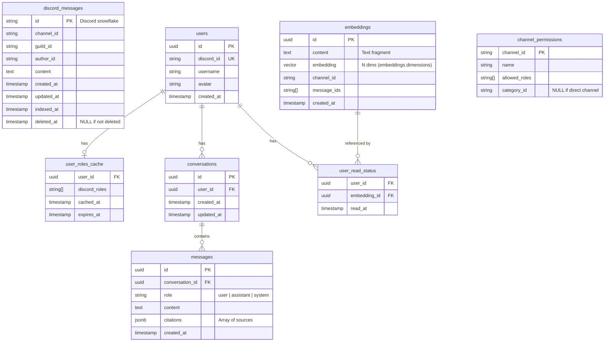

# Data Model Documentation

This document describes the data model for **Hivly Self-Hosted**, including entity descriptions, field definitions, relationships, and an entity-relationship diagram.

**Source of truth:** all tables are defined with Drizzle in `packages/shared/src/db/schema.ts`. No service defines tables or performs DDL outside `packages/shared` (AD-5). Migrations are generated as explicit SQL with `drizzle-kit`.

**Conventions:**
- IDs: Discord snowflake (`string`) for Discord entities; UUID v4 for own entities (conversations, embeddings, users).
- Dates: `timestamp with time zone` in PostgreSQL; ISO 8601 UTC when serialized.
- Vector search uses the `pgvector` extension. Embedding provider/model are configurable (`embeddings.*`); the vector dimension is declared in `embeddings.dimensions` (deploy-time) — default `text-embedding-3-small` / 1536.
- **Sessions are NOT a table** — they live in Redis via `connect-redis` (AD-10).

## Write Ownership

Only the service that owns a table writes to it (AD, State Ownership):

| Table | Owner (writes) | Readers |
|---|---|---|
| `discord_messages` | bot | workers, backend |
| `embeddings` | workers — Indexer (insert), Sync (update/delete) | backend |
| `channel_permissions` | backend (upsert from config at startup) | backend |
| `user_roles_cache` | backend (login + OAuth2 refresh) | backend |
| `conversations`, `messages` | backend | web (via API) |
| `user_read_status` | backend | web (via API) |
| `users` | backend (Discord OAuth2 login) | backend |

## Model Descriptions

### 1. discord_messages
Raw Discord messages captured by the Bot. The Bot is the only writer.

**Fields:**
- `id`: Discord snowflake (Primary Key, string)
- `channel_id`: Discord channel snowflake
- `guild_id`: Discord guild snowflake
- `author_id`: Discord author snowflake
- `content`: message text
- `created_at`: message creation timestamp
- `updated_at`: last edit timestamp
- `indexed_at`: set by the Indexer once embeddings are produced (nullable)
- `deleted_at`: soft-delete marker (nullable; NULL if not deleted)

**Notes:** the Bot tracks `last_seen_message_id` per channel (the highest snowflake seen) to reconcile backfill after downtime.

### 2. embeddings
Vector index over grouped/chunked message content. Written by the Workers; read by the Backend for search and RAG.

**Fields:**
- `id`: UUID (Primary Key)
- `content`: chunk text (concatenated from grouped messages)
- `embedding`: `vector(N)` where `N = embeddings.dimensions` (pgvector; parametrized at deploy-time, default 1536)
- `channel_id`: Discord channel snowflake (used for the RBAC filter)
- `message_ids`: `string[]` of source Discord snowflakes contributing to the chunk
- `created_at`: timestamp

**Notes:** Workers are idempotent — re-processing must UPSERT on `id`, never error (at-least-once delivery, AD-13).

### 3. users
Application users, created on Discord OAuth2 login. Backend-owned.

**Fields:**
- `id`: UUID (Primary Key)
- `discord_id`: Discord user snowflake (Unique)
- `username`: Discord username
- `avatar`: avatar hash/URL
- `created_at`: timestamp

### 4. user_roles_cache
Cached Discord roles per user, to answer RBAC without hitting the Discord API on every request. TTL-based.

**Fields:**
- `user_id`: FK → users.id
- `discord_roles`: `string[]` of Discord role IDs in the guild
- `cached_at`: timestamp
- `expires_at`: TTL expiry (configurable via `access_control.role_cache_ttl`)

### 5. channel_permissions
RBAC policy materialized from `Hivly.config.yml` at Backend startup (upsert). Maps channels to the roles allowed to read them.

**Fields:**
- `channel_id`: Discord channel snowflake (Primary Key)
- `name`: human-readable channel name
- `allowed_roles`: `string[]` of Discord role IDs allowed to access the channel
- `category_id`: Discord category snowflake (nullable; NULL for direct channels)

**Notes:** `allowedChannelIds` are computed per request by joining `session.discordRoles` against this table (not cached in the session), so a permissions change takes effect on the next request (AD-12).

### 6. conversations
A user's chat conversation with the RAG agent. Backend-owned.

**Fields:**
- `id`: UUID (Primary Key)
- `user_id`: FK → users.id
- `created_at`: timestamp
- `updated_at`: timestamp

### 7. messages
Individual messages within a conversation (user / assistant / system), with citations.

**Fields:**
- `id`: UUID (Primary Key)
- `conversation_id`: FK → conversations.id
- `role`: `"user" | "assistant" | "system"`
- `content`: message text
- `citations`: `jsonb` array of sources (channel, author, date)
- `created_at`: timestamp

### 8. user_read_status
Per-user read tracking over indexed fragments.

**Fields:**
- `user_id`: FK → users.id
- `embedding_id`: FK → embeddings.id
- `read_at`: timestamp

## Entity Relationship Diagram



## Critical Indexes

```sql
-- Vector search (HNSW, cosine)
CREATE INDEX idx_embeddings_vector ON embeddings USING hnsw (embedding vector_cosine_ops);

-- RBAC filter on vector search
CREATE INDEX idx_embeddings_channel ON embeddings(channel_id);

-- Channel/date lookups over Discord messages
CREATE INDEX idx_discord_messages_channel ON discord_messages(channel_id, created_at DESC);

-- Read tracking
CREATE INDEX idx_user_read_status_user ON user_read_status(user_id);
CREATE INDEX idx_user_read_status_embedding ON user_read_status(embedding_id);
```

## Key Design Principles

1. **RBAC at the query layer**: every vector query includes `WHERE channel_id = ANY(:allowedChannelIds)` — the filter is part of the SQL, never a post-filter (AD-12).
2. **Single DDL source**: all tables and migrations originate in `packages/shared` (AD-5); no service diverges.
3. **Idempotent ingestion**: at-least-once Redis Streams delivery means Workers UPSERT embeddings rather than assume single delivery (AD-13).
4. **Config-materialized permissions**: `channel_permissions` is derived from `Hivly.config.yml` on Backend startup — there is no admin panel; everything is code/config.
5. **Sessions out of PostgreSQL**: sessions live in Redis with TTL for fast reads and immediate revocation (AD-10).

## Notes

- Own entities (`users`, `conversations`, `messages`, `embeddings`) use UUID v4 primary keys; Discord entities use snowflake string IDs.
- The `sessions` table referenced in early drafts of the PRD **does not exist** — Redis is the single source of truth for sessions.
- Optional/nullable fields (`indexed_at`, `deleted_at`, `category_id`) allow flexible state while keeping required core information.
